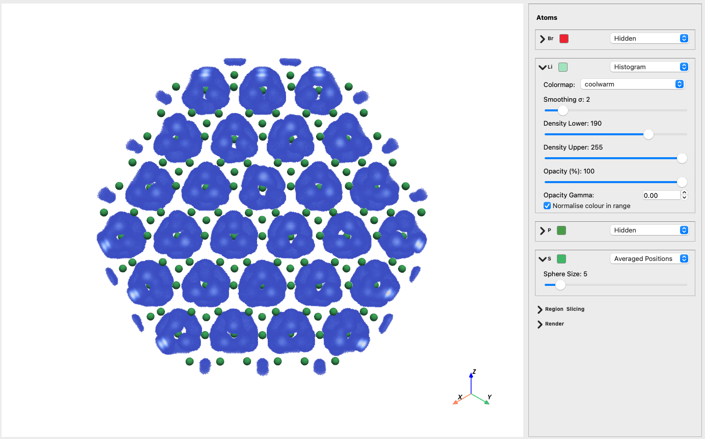
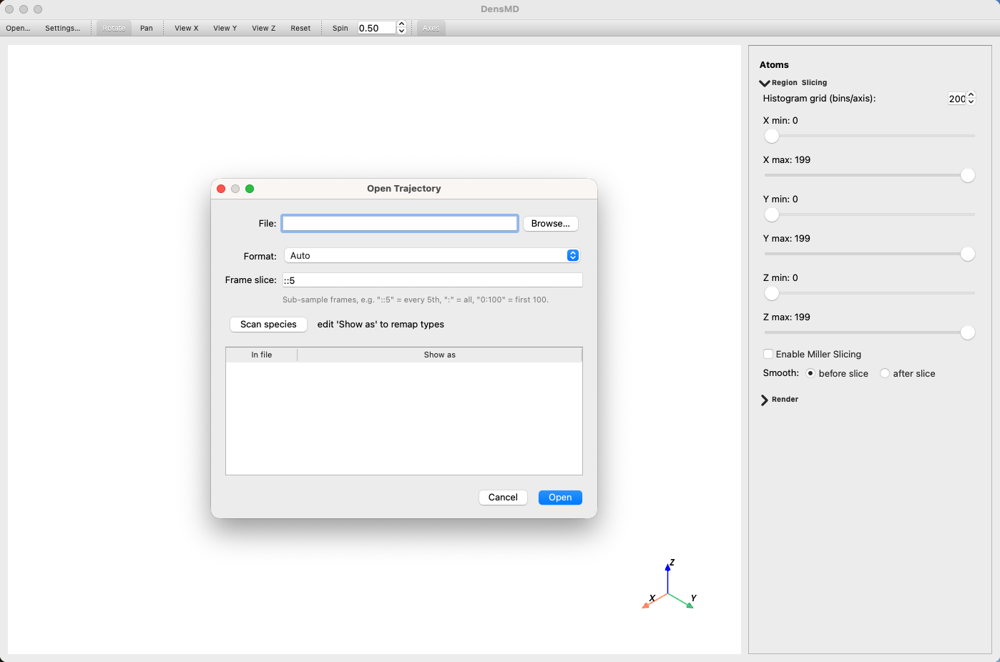
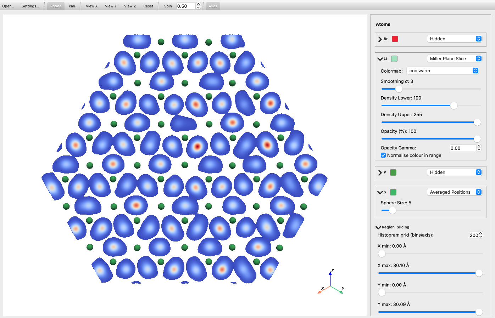

# DensMD

A (becoming less) simple PyQt5-based application for visualising atomic trajectory data in 3D, designed specifically for molecular dynamics analysis.


## Overview

DensMD provides a powerful, quick, interactive GUI for loading molecular dynamics trajectory data, computing density histograms/isosurfaces and averaged positions, and visualising the results with various rendering modes and slicing options. The tool is particularly useful for analysing atomic distributions and migrations in crystal structures.

## Features

- **Multiple Visualisation Modes**
  - Voxel density histograms
  - Nested isosurface shells 
  - Atomic positions 
  - Per-atom type visualisation settings

- **Miller Plane Slicing**
  - Define custom Miller indices (hkl)
  - Adjustable slice thickness and offset
  - Automatic camera alignment to plane

## Screenshots

The new loading UI, which allows you to select a file, set a frame slice and optionally remap atom types.




A miller slice of 1 atom type shown and the average positions of a second atom type plotted.



## Installation

1. Clone this repository:
   ```bash
   git clone https://github.com/ChrisDavi3s/densmd.git
   cd densmd
   ```

2. Create and activate a virtual environment (recommended):
   ```bash
   python -m venv venv
   source venv/bin/activate  # On Windows: venv\Scripts\activate
   ```

3. Install dependencies:
   ```bash
   pip install -r requirements.txt
   ```

## Usage

No source editing required. Launch the app and load a file from the menu:

```bash
python -m densmd        # or: python run_densmd.py
```

On launch an **Open Trajectory** dialog appears. Pick a file (format is
auto-detected from the extension), set a frame slice such as `::5`, and
optionally supply an atom-type remap like `H:Li, He:P, Li:S`. You can reopen it
any time via **File > Open**.

To open a file directly from the command line:

```bash
python run_densmd.py /path/to/traj.dat --slice ::5 --map H:Li,He:P
```
.
Other compute defaults (smoothing, update delay, plane resolution) also live in
**File > Settings** and persist to `~/.densmd.json`.

## Architecture

```
densmd/
  config.py     runtime settings + JSON persistence
  io.py         trajectory loading, slice parsing, type remap
  miller.py     Miller-plane geometry (normals, masks, filtering)
  unwrap.py     representative positions (PBC-aware mode / circular mean)
  model.py      compute core: histograms, smoothing/region caches, scalar fields
  render.py     PyVista/VTK layer: volumes, isosurfaces, LUTs, stereo, camera
  ui/           Qt widgets, panels, dialogs, main window
  app.py        application boot
```

Updates are split into two tiers. *Geometry* changes (ROI, Miller, smoothing)
recompute a scalar field, debounced. *Appearance* changes (colour, opacity,
gamma, colormap) only re-run a cheap RGBA/LUT remap over cached arrays on the
existing actor, so slider drags are effectively free — no density recompute
and no camera jump.

## Dependencies

- PyQt5
- PyVista / pyvistaqt
- NumPy
- SciPy
- ASE (Atomic Simulation Environment)
- VTK

## Future Development

Still planned:
- Export functionality for images and videos
- Measurement tools for atomic distances and angles
- Miller slicing and calculation of what to render is still incredibly slow and rudamentary. Whole visualisation pipeline needs to be reworked to allow for more efficient slicing and rendering of Miller planes / selection of what to render! 

Feature Requests are welcome!

## License

This project is licensed under the GNU Affero General Public License v3.0 - see the [LICENSE](LICENSE) file for details.

## Credits

Developed by Chris Davies (2025/26) @ Uni of Oxford, Department of Materials.

## Contributing

Contributions are welcome! Please feel free to submit a Pull Request.

1. Fork the repository
2. Create your feature branch (`git checkout -b feature/amazing-feature`)
3. Commit your changes (`git commit -m 'Add some amazing feature'`)
4. Push to the branch (`git push origin feature/amazing-feature`)
5. Open a Pull Request
