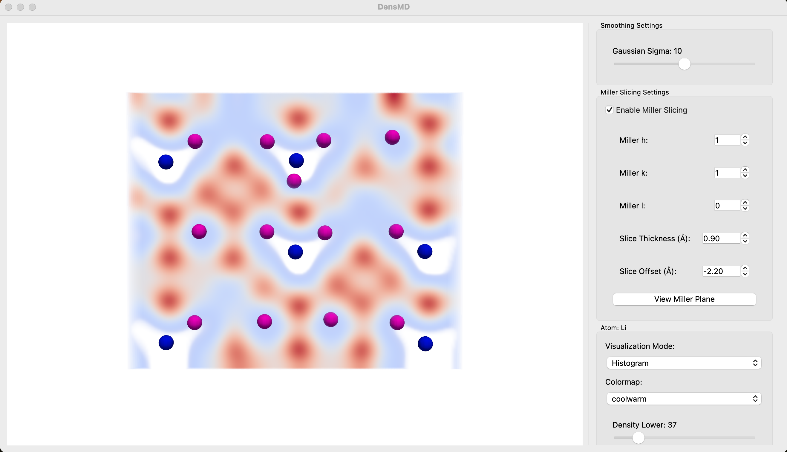
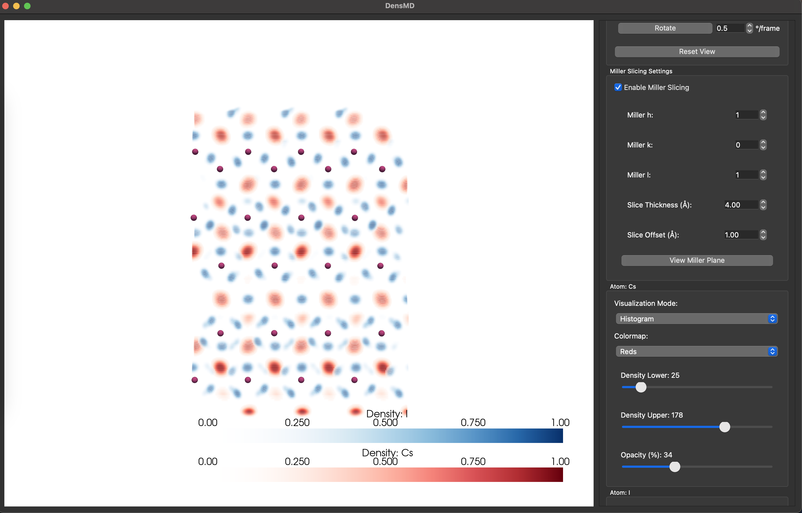

# DensMD

A PyQt5-based application for visualising atomic trajectory data in 3D, designed specifically for molecular dynamics analysis.



## Overview

DensMD provides a powerful, interactive GUI for loading molecular dynamics trajectory data, computing density histograms and averaged positions, and visualising the results with various rendering modes and slicing options. The tool is particularly useful for analysing atomic distributions and migrations in crystal structures.

## Features

- **Multiple Visualisation Modes**
  - Density histograms with customisable colour maps
  - Averaged atomic positions with adjustable sphere sizes
  - Per-atom type visualisation settings

- **Interactive Region Selection**
  - Adjustable 3D bounding box
  - Real-time parameter updates
  - Individual axis control

- **Miller Plane Slicing**
  - Define custom Miller indices (hkl)
  - Adjustable slice thickness and offset
  - Automatic camera alignment to plane

- **View Controls**
  - Automated rotation animation
  - Standard axis views (X, Y, Z)
  - Camera reset function

- **Data Processing**
  - Support for pickle and ASE data formats
  - Efficient vectorised computation
  - Gaussian smoothing for density visualisation

## Screenshots

A miller slice of 2 atom types shown as differently coloured histograms, and the average positions of a thrid atom type plotted.



## Installation

1. Clone this repository:
   ```bash
   git clone https://github.com/ChrisDavi3s/densmd.git
   cd densmd
   ```

2. Create and activate a virtual environment (recommended):
   ```bash
   python -m venv venv
   source venv/bin/activate  # On Windows: venv\Scripts\activate
   ```

3. Install dependencies:
   ```bash
   pip install -r requirements.txt
   ```

## Usage

1. Configure your input file in the `INPUT_FILE_CONFIG` section of the code:
   ```python
   INPUT_FILE_CONFIG = {
       'path': '/path/to/your/data.pickle',
       'format': 'pickle',  # 'pickle' or 'ase'
       'slice': "::10",  # For frame subsampling
   }
   ```

2. Run the application:
   ```bash
   python run_densmd.py
   ```

3. Use the control panel on the right to:
   - Select visualisation modes for each atom type
   - Adjust density thresholds and opacity
   - Control region of interest (ROI) slicing
   - Set Miller indices for crystallographic plane slicing
   - Rotate and reorient the view

## Dependencies

- PyQt5
- PyVista / pyvistaqt
- NumPy
- SciPy
- ASE (Atomic Simulation Environment)
- VTK
- tqdm

## Future Development

This project is currently implemented as a single file but will be refactored into multiple modules for improved maintainability. Planned improvements include:

- Multi-file architecture with MVC pattern
- Additional visualisation modes
- Export functionality for images and videos
- Support for more trajectory file formats
- Improved Miller plane visualisation
- Measurement tools for atomic distances and angles

## License

This project is licensed under the MIT License - see the [LICENSE](LICENSE) file for details.

## Credits

Developed by Chris Davies (2025)

## Contributing

Contributions are welcome! Please feel free to submit a Pull Request.

1. Fork the repository
2. Create your feature branch (`git checkout -b feature/amazing-feature`)
3. Commit your changes (`git commit -m 'Add some amazing feature'`)
4. Push to the branch (`git push origin feature/amazing-feature`)
5. Open a Pull Request
